<p align="center">
</a>
</p>

# Webhook Bridge

A high-performance webhook integration platform with **unified architecture**. Features a single executable that combines Go's performance with Python's flexibility through integrated service management.

[](https://golang.org/)
[](https://pypi.org/project/webhook-bridge/)
[](https://pypi.org/project/webhook-bridge/)
[](https://github.com/loonghao/webhook_bridge/actions)
[](https://github.com/loonghao/webhook_bridge/actions)
[](https://github.com/loonghao/webhook_bridge/blob/main/LICENSE)
[](https://github.com/loonghao/webhook_bridge/releases)
[](https://pepy.tech/project/webhook-bridge)



```mermaid
flowchart TB
    subgraph "External Sources"
        A[GitLab]
        B[GitHub]
        C[Sentry]
        D[Other Webhooks]
    end

    subgraph "Webhook Bridge - Unified Architecture"
        subgraph "Single Executable (webhook-bridge.exe)"
            E[Unified CLI]
            F[Go HTTP Server]
            G[Python Executor Manager]
            H[Web Dashboard]
        end

        subgraph "Service Components"
            I[Python Executor Service]
            J[Plugin Loader]
            K[Plugin Manager]
            L[gRPC Communication]
        end

        subgraph "Plugin System"
            M[Custom Plugins]
            N[Example Plugins]
            O[Legacy Plugins]
        end
    end

    subgraph "Outputs"
        P[Internal Integration]
        Q[API Responses]
        R[Logs & Metrics]
    end

    A -.->|HTTP POST| F
    B -.->|HTTP POST| F
    C -.->|HTTP POST| F
    D -.->|HTTP POST| F

    E --> F
    E --> G
    F --> H
    G -->|Auto-start| I
    F -->|gRPC| L
    L --> I

    I --> J
    J --> K
    K --> M
    K --> N
    K --> O

    M --> P
    N --> P
    O --> P

    F --> Q
    K --> R

    style A fill:#FCA326
    style B fill:#24292e
    style C fill:#362D59
    style D fill:#95A5A6
    style E fill:#FF6B6B
    style F fill:#00D4AA
    style G fill:#E74C3C
    style H fill:#3498DB
    style I fill:#9B59B6
    style J fill:#F39C12
    style K fill:#E67E22
    style L fill:#2ECC71
    style M fill:#FF6B6B
    style N fill:#4ECDC4
    style O fill:#95A5A6
    style P fill:#1ABC9C
    style Q fill:#34495E
    style R fill:#7F8C8D
```

## 🚀 **v2.0.0+ - Unified Architecture Revolution**

**Breaking Change**: Webhook Bridge has been completely rewritten with a unified architecture that combines multiple executables into a single, powerful binary.

### **🏗️ Unified Architecture**
- **📦 Single Executable**: One binary (`webhook-bridge.exe`) for all functionality
- **⚡ Integrated Go Server**: High-performance HTTP server with built-in service management
- **🐍 Managed Python Executor**: Automatic Python service startup and management
- **🔗 Seamless Communication**: Internal gRPC communication between components
- **🎨 Modern Dashboard**: Beautiful React-based web interface with Tailwind CSS
- **📦 Multi-platform Binaries**: Native binaries for Linux, Windows, and macOS
- **🐳 Docker Ready**: Production-ready containerized deployment

## Features

- 📦 **Unified Binary**: Single executable for all operations - no more multiple processes
- ⚡ **High Performance**: Go HTTP server with concurrent request handling
- 🔌 **Plugin System**: Dynamic Python plugin loading with automatic executor management
- 🌐 **RESTful API**: Support for GET, POST, PUT, DELETE HTTP methods
- 🎛️ **Modern Dashboard**: React-based web interface for management and monitoring
- 🛠️ **Flexible Configuration**: YAML configuration with environment variable support
- 📝 **Rich Documentation**: Interactive API documentation and comprehensive guides
- 🔒 **Secure**: Built-in security features, input validation, and error handling
- 📊 **Observability**: Comprehensive logging, metrics, and health checks
- 🐳 **Container Ready**: Docker and Docker Compose support with volume mounts
- 🔄 **Backward Compatible**: Supports existing v0.6.0 Python plugins

## 📦 Installation

### **🎯 Quick Start (Recommended)**

Download and run the unified binary:
```bash
# Download latest release for your platform
# Linux AMD64
wget https://github.com/loonghao/webhook_bridge/releases/latest/download/webhook_bridge_Linux_x86_64.tar.gz
tar -xzf webhook_bridge_Linux_x86_64.tar.gz

# Start the unified service (Python executor + Go server)
./webhook-bridge unified --port 8080

# Or use the standalone server mode
./webhook-bridge serve --port 8080
```

### **� Docker (Recommended for Production)**

```bash
# Quick start with Docker
docker run -p 8000:8000 -p 50051:50051 ghcr.io/loonghao/webhook-bridge:latest

# Or with docker-compose (recommended)
curl -O https://raw.githubusercontent.com/loonghao/webhook_bridge/main/docker-compose.yml
docker-compose up -d
```

### **⚡ All Platform Binaries**

Download pre-built binaries from [GitHub Releases](https://github.com/loonghao/webhook_bridge/releases):

```bash
# Linux AMD64
wget https://github.com/loonghao/webhook_bridge/releases/latest/download/webhook_bridge_Linux_x86_64.tar.gz
tar -xzf webhook_bridge_Linux_x86_64.tar.gz

# Linux ARM64
wget https://github.com/loonghao/webhook_bridge/releases/latest/download/webhook_bridge_Linux_arm64.tar.gz
tar -xzf webhook_bridge_Linux_arm64.tar.gz

# Windows AMD64
# Download webhook_bridge_Windows_x86_64.zip and extract

# macOS (Intel)
wget https://github.com/loonghao/webhook_bridge/releases/latest/download/webhook_bridge_Darwin_x86_64.tar.gz
tar -xzf webhook_bridge_Darwin_x86_64.tar.gz

# macOS (Apple Silicon)
wget https://github.com/loonghao/webhook_bridge/releases/latest/download/webhook_bridge_Darwin_arm64.tar.gz
tar -xzf webhook_bridge_Darwin_arm64.tar.gz
```

### **� Legacy Python Package (Compatibility)**

For backward compatibility with existing setups:
```bash
# Install Python package (includes Python executor only)
pip install webhook-bridge

# Note: You'll still need the Go server binary for full functionality
```

## 🚀 Quick Start

### **1. Start the Server**

```bash
# Method 1: Unified service (recommended - Python executor + Go server)
./webhook-bridge unified --port 8080

# Method 2: Standalone server (Go server only)
./webhook-bridge serve --port 8080

# Method 3: Development mode with auto-reload
./webhook-bridge start --verbose

# Method 4: Docker (production ready)
docker-compose up -d
```

### **2. Access the Modern Dashboard**

Open your browser and navigate to:
- **🎛️ Dashboard**: `http://localhost:8000/` - Modern React-based interface
- **📖 API Documentation**: `http://localhost:8000/docs` - Interactive API reference
- **❤️ Health Check**: `http://localhost:8000/health` - Service status
- **📊 Metrics**: `http://localhost:8000/metrics` - Performance metrics

### **3. Test with Sample Request**

```bash
# Test webhook endpoint with example plugin
curl -X POST "http://localhost:8000/api/v1/webhook/example" \
     -H "Content-Type: application/json" \
     -d '{"message": "Hello, Hybrid Architecture!"}'

# Check server health
curl "http://localhost:8000/health"

# List available plugins
curl "http://localhost:8000/api/v1/plugins"

# Get system information
curl "http://localhost:8000/api/v1/system/info"
```

### **4. Unified Binary Commands**

The single binary provides all functionality through subcommands:

```bash
# Unified service (recommended - all-in-one)
./webhook-bridge unified --port 8080    # Python executor + Go server

# Individual components
./webhook-bridge serve --port 8080      # Go server only
./webhook-bridge server --port 8080     # Backend server with gRPC client
./webhook-bridge python info            # Python environment management

# Development and management
./webhook-bridge start                  # Full development mode
./webhook-bridge build                  # Build project
./webhook-bridge status                 # Check service status
```

📖 **详细CLI使用指南**:
- [完整CLI使用文档](docs/CLI_USAGE.md) - 包含所有命令详解、故障排除、最佳实践
- [CLI快速参考](docs/CLI_QUICK_REFERENCE.md) - 常用命令速查表

## Configuration

### YAML Configuration

Webhook Bridge uses YAML configuration files for flexible setup:

```yaml
# config.yaml
server:
  host: "0.0.0.0"
  port: 8000
  mode: "release"  # debug, release

python:
  strategy: "auto"  # auto, uv, path, custom
  grpc_port: 50051
  timeout: 30
  plugin_dirs:
    - "./plugins"
    - "./example_plugins"

logging:
  level: "info"
  format: "json"  # json, text
  file: "./logs/webhook-bridge.log"

dashboard:
  enabled: true
  path: "/web-nextjs/dist"
```

### Command Line Options

```bash
# Unified service options
webhook-bridge unified --help
webhook-bridge serve --help
webhook-bridge python --help
```

#### Unified Service Configuration
- `--config`: Configuration file path (default: "config.yaml")
- `--host`: Host to bind the server to (default: "0.0.0.0")
- `--port`: HTTP server port (default: 8080)
- `--log-level`: Logging level (debug/info/warn/error)
- `--mode`: Server mode (debug/release)
- `--no-python`: Skip Python executor startup (API-only mode)

#### Python Management
- `webhook-bridge python info`: Show Python environment information
- `webhook-bridge python validate`: Validate Python environment
- `webhook-bridge python install [packages]`: Install Python packages

#### Development Options
- `--verbose`: Enable verbose logging
- `--debug`: Enable debug mode

### Environment Variables

All configuration options can be set via environment variables:

```bash
# Server configuration
export WEBHOOK_BRIDGE_HOST="0.0.0.0"
export WEBHOOK_BRIDGE_PORT="8000"
export WEBHOOK_BRIDGE_GRPC_PORT="50051"
export WEBHOOK_BRIDGE_LOG_LEVEL="info"
export WEBHOOK_BRIDGE_MODE="release"

# Python executor configuration
export WEBHOOK_BRIDGE_PYTHON_STRATEGY="auto"
export WEBHOOK_BRIDGE_PYTHON_PATH="/usr/bin/python3"
export WEBHOOK_BRIDGE_PLUGIN_DIRS="./plugins:./example_plugins"

# Docker-specific variables
export WEBHOOK_BRIDGE_CONFIG_PATH="/app/config"
export WEBHOOK_BRIDGE_DATA_PATH="/app/data"
export WEBHOOK_BRIDGE_LOG_PATH="/app/logs"
```

### Usage Examples

#### Basic Usage
```bash
# Start unified service with default settings
./webhook-bridge unified

# Start with custom configuration
./webhook-bridge unified --config config.prod.yaml

# Start on specific host and port
./webhook-bridge unified --host 127.0.0.1 --port 9000
```

#### Production Deployment
```bash
# Production unified service with custom config
./webhook-bridge unified --config config.prod.yaml --log-level info --mode release

# Docker production deployment
docker run -d \
  --name webhook-bridge \
  -p 8080:8080 \
  -v ./config:/app/config \
  -v ./plugins:/app/plugins \
  -v ./logs:/app/logs \
  ghcr.io/loonghao/webhook-bridge:latest

# Docker Compose (recommended)
docker-compose up -d
```

#### Development Mode
```bash
# Development with verbose logging
./webhook-bridge unified --verbose

# Development mode with auto-reload
./webhook-bridge start --verbose

# API-only mode (no Python executor)
./webhook-bridge unified --no-python
```

### Architecture Benefits

The unified architecture provides:

- **📦 Simplicity**: Single binary for all operations - no more process management
- **🚀 Performance**: Go HTTP server handles thousands of concurrent requests
- **🔧 Flexibility**: Python plugins for rapid development and rich ecosystem
- **🔗 Integration**: Seamless communication between Go server and Python executor
- **🔄 Compatibility**: Existing Python plugins work without modification
- **📦 Deployment**: True single binary deployment with automatic service management
- **🐳 Containerization**: Docker-ready with simplified configuration

### Development Workflow

Modern development experience with:

- **🛠️ Unified CLI**: Single binary for all operations
- **🔄 Hot Reload**: Automatic restart on configuration changes
- **📊 Observability**: Built-in metrics, logging, and health checks
- **🎛️ Dashboard**: React-based web interface for management
- **🧪 Testing**: Comprehensive test suite for both Go and Python components
- **📚 Documentation**: Interactive API docs and comprehensive guides

## Plugin Development

### 🐍 **Python Plugin Development**

#### **1. Install the Python API Package**

To develop Python plugins, you need to install the `webhook-bridge` Python package:

```bash
# Install the Python API package
pip install webhook-bridge

# Or using uv (recommended)
uv pip install webhook-bridge
```

This package provides the `BasePlugin` class and all necessary APIs for plugin development.

#### **2. Create Your Plugin**

Create a Python file in your plugin directory and inherit from `BasePlugin`:

```python
# my_plugin.py
from typing import Dict, Any
from webhook_bridge.plugin import BasePlugin


class Plugin(BasePlugin):
    """Custom webhook plugin.

    Note: The class MUST be named 'Plugin' for automatic discovery.
    """

    def handle(self) -> Dict[str, Any]:
        """Generic handler for all HTTP methods.

        Available attributes:
        - self.data: Dict containing webhook payload
        - self.logger: Logger instance for the plugin
        - self.http_method: HTTP method (GET/POST/PUT/DELETE)

        Returns:
            Dict[str, Any]: Processed result
        """
        # Access webhook data
        message = self.data.get("message", "No message")

        # Log plugin execution
        self.logger.info(f"Processing {self.http_method} request with message: {message}")

        # Process your webhook data here
        result = {
            "status": "success",
            "data": {
                "processed_message": f"Processed: {message}",
                "method": self.http_method,
                "timestamp": "2024-01-01T00:00:00Z"
            }
        }
        return result

    def get(self) -> Dict[str, Any]:
        """Handle GET requests specifically."""
        return {
            "status": "success",
            "data": {"message": "GET request processed", "method": "GET"}
        }

    def post(self) -> Dict[str, Any]:
        """Handle POST requests specifically."""
        return {
            "status": "success",
            "data": {"message": "POST request processed", "method": "POST"}
        }

    def put(self) -> Dict[str, Any]:
        """Handle PUT requests specifically."""
        return {
            "status": "success",
            "data": {"message": "PUT request processed", "method": "PUT"}
        }

    def delete(self) -> Dict[str, Any]:
        """Handle DELETE requests specifically."""
        return {
            "status": "success",
            "data": {"message": "DELETE request processed", "method": "DELETE"}
        }
```

#### **3. Plugin Execution Flow**

The plugin execution follows this hybrid architecture flow:

```
1. HTTP Request → Go HTTP Server (Port 8000)
2. Request Validation → Go server validates and routes request
3. gRPC Call → Go server calls Python Executor (Port 50051)
4. Plugin Loading → Python executor loads your plugin class
5. Method Routing → Calls appropriate method based on HTTP method
6. Execution → Your plugin code runs with webhook data
7. Response → Results sent back through gRPC to Go server
8. HTTP Response → Go server returns formatted response to client
```

#### **4. Plugin Requirements**

The plugin must:
1. **Class Name**: Must be named `Plugin` for automatic discovery
2. **Inheritance**: Inherit from `BasePlugin`
3. **Methods**: Implement at least the `handle` method (generic handler)
4. **Optional Methods**: Implement method-specific handlers: `get`, `post`, `put`, `delete`
5. **Return Format**: Return a dictionary containing:
   - `status`: String indicating success or failure
   - `data`: Dictionary containing the processed result

#### **5. Dashboard Plugin Testing**

The modern React Dashboard provides **visual plugin execution** capabilities:

**🧪 Plugin Testing Features:**
- **Plugin List**: View all available plugins with status and metadata
- **Interactive Testing**: Manually execute plugins with custom data
- **Method Selection**: Test different HTTP methods (GET/POST/PUT/DELETE)
- **Real-time Results**: View execution results and performance metrics
- **Error Debugging**: Detailed error messages and stack traces

**Testing Example in Dashboard:**
```json
{
  "plugin": "my_plugin",
  "method": "POST",
  "test_data": {
    "message": "Hello from Dashboard!",
    "user_id": 12345
  },
  "expected_result": {
    "status": "success",
    "data": {
      "processed_message": "Processed: Hello from Dashboard!",
      "method": "POST"
    }
  }
}
```

Access the Dashboard at: `http://localhost:8000/` → **Plugins** tab → **Test Plugin**

## Development

### Prerequisites

- **Go 1.21+**: For building the HTTP server
- **Python 3.8+**: For plugin development and executor
- **Node.js 18+**: For dashboard development (optional)
- **Protocol Buffers**: For gRPC code generation

### Setup Development Environment

1. Clone the repository:
```bash
git clone https://github.com/loonghao/webhook_bridge.git
cd webhook_bridge
```

2. Setup development environment:
```bash
# Install Go dependencies and setup tools
go run dev.go dev-setup

# Install dashboard dependencies (optional)
go run dev.go dashboard install

# Generate protobuf files
go run dev.go proto
```

3. Run tests:
```bash
# Run all tests
go run dev.go test

# Run Go tests only
go test ./...

# Run Python tests only
cd python_executor && python -m pytest
```

4. Build and run:
```bash
# Build all components
go run dev.go build

# Run in development mode
go run dev.go serve --dev
```

### Project Structure

```
webhook_bridge/
├── cmd/                    # Go applications
│   ├── server/            # Main HTTP server
│   ├── webhook-bridge/    # Unified CLI
│   └── python-manager/    # Python executor manager
├── internal/              # Go internal packages
│   ├── server/           # HTTP server implementation
│   ├── python/           # Python executor management
│   ├── config/           # Configuration management
│   └── web/              # Web dashboard handlers
├── python_executor/       # Python gRPC server
├── webhook_bridge/        # Python package (legacy compatibility)
├── web-nextjs/            # Next.js dashboard
│   ├── app/              # Next.js App Router pages
│   └── dist/             # Built dashboard assets
├── example_plugins/       # Example Python plugins
├── api/proto/            # Protocol buffer definitions
├── docs/                 # Documentation
└── tests/                # Test files
```

## API Endpoints

### Version 1 (`api/v1`)

#### List Plugins
- `GET api/v1/plugins`: List all available webhook plugins
  - Response 200:
    ```json
    {
        "status_code": 200,
        "message": "success",
        "data": {
            "plugins": ["plugin1", "plugin2"]
        }
    }
    ```

#### Execute Plugin
- `GET api/v1/plugin/{plugin_name}`: Execute a specific webhook plugin with GET method
  - Parameters:
    - `plugin_name`: Name of the plugin to execute
    - Query parameters: Data to be processed by the plugin
  - Response 200: Standard response format

- `POST api/v1/plugin/{plugin_name}`: Execute a specific webhook plugin with POST method
  - Parameters:
    - `plugin_name`: Name of the plugin to execute
    - Request body: JSON data to be processed by the plugin
  - Response 200: Standard response format

- `PUT api/v1/plugin/{plugin_name}`: Execute a specific webhook plugin with PUT method
  - Parameters:
    - `plugin_name`: Name of the plugin to execute
    - Request body: JSON data to be processed by the plugin
  - Response 200: Standard response format

- `DELETE api/v1/plugin/{plugin_name}`: Execute a specific webhook plugin with DELETE method
  - Parameters:
    - `plugin_name`: Name of the plugin to execute
    - Query parameters: Data to be processed by the plugin
  - Response 200:
    ```json
    {
        "status_code": 200,
        "message": "success",
        "data": {
            "plugin": "example",
            "src_data": {"key": "value"},
            "result": {
                "status": "success",
                "data": {"key": "value"}
            }
        }
    }
    ```
  - Error Responses:
    - 404: Plugin not found
    - 500: Plugin execution failed

## Error Handling

The API uses standard HTTP status codes and returns detailed error messages:

```json
{
    "status_code": 404,
    "message": "Plugin not found",
    "data": {
        "error": "Plugin not found"
    }
}
```

## Contributing

1. Fork the repository
2. Create your feature branch (`git checkout -b feature/amazing-feature`)
3. Commit your changes (`git commit -m 'Add some amazing feature'`)
4. Push to the branch (`git push origin feature/amazing-feature`)
5. Open a Pull Request
