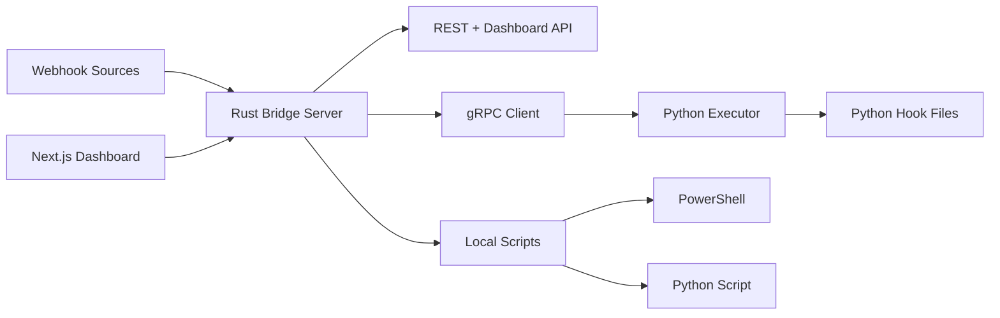

# Webhook Bridge 4.0 Architecture

Webhook Bridge 4.0 uses a Rust host runtime while preserving the core idea from
`loonghao/webhook_bridge` v0.6.0: users write webhook logic as small hook files
or scripts, and the bridge handles HTTP, routing, execution, observability, and
deployment ergonomics.

## Runtime Shape



## Components

- `crates/bridge-core`: shared Rust config, generated gRPC client, and Python
  executor process launcher.
- `crates/bridge-server`: Axum HTTP server, dashboard API, health endpoints,
  unified `/gateway` ingress, script groups, forwarding routes, and
  `/api/webhook/{plugin}` direct execution route.
- `python_executor`: existing Python gRPC service, kept as the execution
  boundary so Python hook authors do not need to learn Rust.
- `webhook_bridge/plugin.py`: compatibility API for hook authors. A plugin file
  exports `class Plugin(BasePlugin)` and implements `handle`, `get`, `post`,
  `put`, `delete`, or `patch`.
- `web-nextjs`: Dashboard UI. It talks to `/api/dashboard/*` and can be served
  separately during development or embedded later for production packaging.

## Hook Example

```python
from webhook_bridge.plugin import BasePlugin


class Plugin(BasePlugin):
    def post(self):
        return {
            "status": "success",
            "payload": self.data,
        }
```

Invoke it through:

```bash
curl -X POST http://localhost:8080/gateway?route=my_hook \
  -H "Content-Type: application/json" \
  -d '{"event": "deploy"}'
```

## Script Fanout

The gateway can map a provider to a script group. A group can run several
routes in parallel, such as saving the raw delivery with PowerShell and sending
a short notification with Python:

```yaml
gateway:
  provider_routes:
    github: "github-fanout"

scripts:
  groups:
    - name: "github-fanout"
      mode: "parallel"
      routes: ["github-save-json", "github-wechat"]
```

## Development

```bash
cargo run -p webhook-bridge-server --bin webhook-bridge -- run --config config.4.0.yaml
cd web-nextjs
npm run dev
```

The Rust service can auto-start the Python executor using the configured Python
interpreter. For manual executor development:

```bash
python -m python_executor.main --config config.4.0.yaml --port 50051
cargo run -p webhook-bridge-server --bin webhook-bridge -- run --config config.4.0.yaml --no-python
```

## CLI

```bash
webhook-bridge run --config config.4.0.yaml
webhook-bridge admin --config config.4.0.yaml
webhook-bridge worker start --config config.4.0.yaml --index 0
webhook-bridge check-config --config config.4.0.yaml
```

- `run` starts the Rust API and, by default, starts the configured Python
  workers.
- `admin` prints the local admin URLs and runtime configuration summary.
- `worker start` starts one standalone Python executor process. This is useful
  for process supervisors or container deployments where workers are managed
  separately from the HTTP API.

## Workers And Storage

`executor.workers` controls how many Python executor processes the Rust server
starts. Worker ports are assigned from `executor.port + index`; for example,
`port: 50051` and `workers: 2` starts workers on `50051` and `50052`.

Execution records and runtime logs are stored in SQLite:

```yaml
storage:
  sqlite_path: "data/webhook-bridge.db"
```

The Dashboard reads real data from this database through:

- `/api/dashboard/stats`
- `/api/dashboard/workers`
- `/api/dashboard/logs`
- `/api/dashboard/plugins/{plugin}/logs`

## E2E Tests

Rust e2e tests live in `crates/bridge-server/tests/e2e.rs`.

They start the real `webhook-bridge` CLI, auto-start Python workers, call HTTP
routes, and assert that SQLite records are written. The GitHub webhook test uses
a local GitHub-style payload so it is deterministic and does not depend on
external network callbacks.

```bash
cargo test -p webhook-bridge-server
```

## Compatibility Notes

- The protobuf contract stays in `api/proto/webhook.proto` so the Python
  executor and future Rust services share one stable execution interface.
- Dashboard endpoints intentionally return the existing `success/data/error`
  response shape to avoid a full frontend rewrite.
